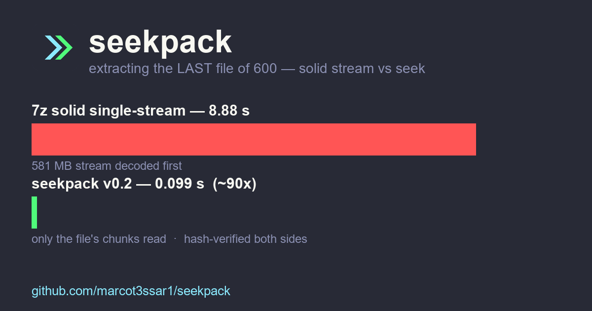

# seekpack (.skp) — l'archivio che salta invece di trascinare

Archivio lossless multi-file per **backup e dataset**, per Windows e Linux.
Un'idea sola, portata fino in fondo: **non leggere mai ciò che non ti serve.**

Estrarre l'ultimo file da 600 archiviati: 7z solido single-stream impiega
**8.88s**, `skp` **0.099s** — stessa macchina, hash verificati da entrambi
i lati ([video](https://youtu.be/FrA3Ury5NHM)). Archivio troncato: 7z muore,
seekpack recupera dal footer ([video](https://youtu.be/_COR5A38Ja0)).



* Chunk seekable + dedup content-defined: il costo di estrazione resta
  piatto al crescere dell'archivio, non lineare.
* Indice scritto due volte (header + footer): sopravvive a teste troncate
  e download interrotti.
* Verifica forte per chunk (xxh3-64 + blake3): un bit flippato nomina il
  chunk colpevole invece di avvelenare l'output.
* Lossless 100%, output deterministico byte-identico.

## Download e uso (2 minuti)

Scarica `skp.exe` (Windows) o `skp` (Linux) dalla sezione Release:

```
skp a backup.skp --level 3 documento.pdf foto/
skp l backup.skp
skp x backup.skp documento.pdf -o out.pdf
skp --version
```

Dettagli completi in `USERGUIDE.md`. Licenza d'uso in `EULA.txt`.

## Edizioni

* **Free** (questa): gratis anche per uso commerciale. Creazione limitata a
  200 file / 2GB totali e livello ≤3. Lettura ed estrazione sempre illimitate.
* **Trial**: ogni installazione parte con le funzioni Pro per 30 giorni,
  poi decade da sola a Free. Gli archivi restano leggibili per sempre.
* **Pro** (€39 una tantum): nessun limite + MT, parity, cifratura,
  scheduler, fattura e supporto. [Pagina Pro — link]

## Licenza e terze parti

Uso regolato da `EULA.txt` (proprietaria). Componenti terzi in
`THIRD_PARTY_NOTICES.txt` (zstd, xxHash, BLAKE3).
